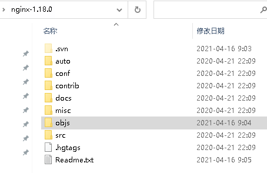
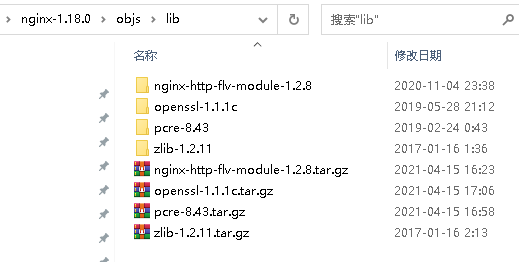
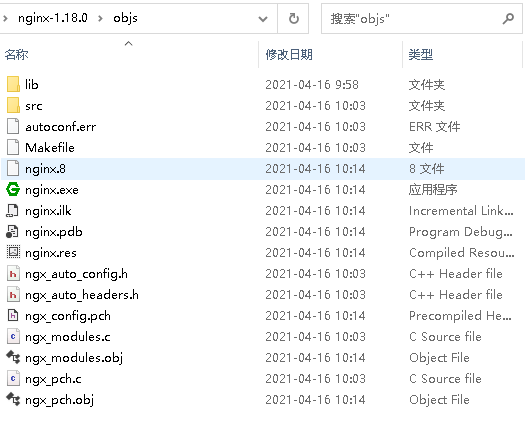
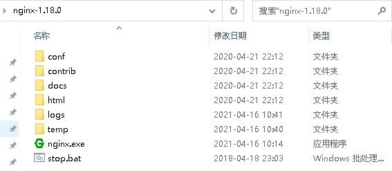

# Nginx Windows下编译和安装 #

参照官网http://nginx.org/en/docs/howto_build_on_win32.html提前下载好编译所需软件

- Microsoft Visual C compiler. Microsoft Visual Studio® 8 and 10 are known to work.
- MSYS.
- Perl, if you want to build OpenSSL® and nginx with SSL support. For example ActivePerl or Strawberry Perl.
- Mercurial client.

命令行sed.exe需要提前下载安装好。`http://gnuwin32.sourceforge.net/packages.html`

1、下载Nginx源码（`http://hg.nginx.org/`）和nginx-http-flv-module（`https://github.com/winshining/nginx-http-flv-module`）源码

注意：官网下载的Nginx版本不支持windows下编译，提示错误：

    C:\nginx-1.18.0>nmake -f objs/Makefile
    
    Microsoft (R) 程序维护实用工具 14.16.27027.1 版
    版权所有 (C) Microsoft Corporation。  保留所有权利。
    
    NMAKE : fatal error U1073: 不知道如何生成“src/os/win32/ngx_win32_config.h”
    Stop.

需要在 `https://github.com/nginx/nginx/releases`下载zip版本。

2、下载依赖库

PCRE: `https://ftp.pcre.org/pub/pcre/pcre-8.43.tar.gz`

ZLIB: `http://zlib.net/zlib-1.2.11.tar.gz`

OPENSSL: `https://www.openssl.org/source/openssl-1.1.1c.tar.gz`

3、解压文件，目录结构如下（objs/lib目录需自行创建）：






4、启动MSYS，进入目录nginx-1.18.0，执行脚本（请提前自行创建目录logs、temp\client_body_temp、temp\proxy_temp、temp\fastcgi_temp、temp\scgi_temp，否则执行脚本会提示目录不存在）：

```
./auto/configure \
    --with-cc=cl \
    --prefix= \
    --conf-path=conf/nginx.conf \
    --pid-path=logs/nginx.pid \
    --http-log-path=logs/access.log \
    --error-log-path=logs/error.log \
    --sbin-path=nginx.exe \
    --http-client-body-temp-path=temp/client_body_temp \
    --http-proxy-temp-path=temp/proxy_temp \
    --http-fastcgi-temp-path=temp/fastcgi_temp \
    --http-scgi-temp-path=temp/scgi_temp \
    --http-uwsgi-temp-path=temp/uwsgi_temp \
    --with-cc-opt=-DFD_SETSIZE=1024 \
    --with-pcre=objs/lib/pcre-8.43 \
    --with-zlib=objs/lib/zlib-1.2.11 \
    --with-openssl=objs/lib/openssl-1.1.1c \
    --with-openssl-opt=no-asm \
    --with-http_ssl_module \
    --add-module=objs/lib/nginx-http-flv-module-1.2.8
```

脚本执行如果提示

    auto/cc/msvc: line 117: [: : integer expression expected


打开auto/cc/msvc文件，添加如下代码：

```
# Copyright (C) Igor Sysoev
# Copyright (C) Nginx, Inc.


# MSVC 6.0 SP2                            cl 12.00
# MSVC Toolkit 2003 (7.1)                 cl 13.10
# MSVC 2005 Express Edition SP1 (8.0)     cl 14.00
# MSVC 2008 Express Edition (9.0)         cl 15.00
# MSVC 2010 (10.0)                        cl 16.00
# MSVC 2015 (14.0)                        cl 19.00


NGX_MSVC_VER=`$NGX_WINE $CC 2>&1 | grep 'Compiler Version' 2>&1 \
                                 | sed -e 's/^.* Version \(.*\)/\1/'`

NGX_MSVC_VER=19.16
```

注意：
`NGX_MSVC_VER`以本地VS命令行 `cl /?` 的结果为准。版本关系见附录一。

上述命令是生成可以通过VS的nmake编译的Makefile，文件生成objs/Makefile

5、打开VS工具命令提示符环境

```
**********************************************************************
** Visual Studio 2017 Developer Command Prompt v15.9.9
** Copyright (c) 2017 Microsoft Corporation
**********************************************************************

C:\Program Files (x86)\Microsoft Visual Studio\2017\Enterprise>
```

切换到Nginx源码根目录，执行命令

    nmake –f objs/Makefile

命令完成后如下：

```
正在搜索库
    正在搜索 C:\Program Files (x86)\Windows Kits\10\lib\10.0.19041.0\um\x86\kernel32.lib:
    正在搜索 C:\Program Files (x86)\Windows Kits\10\lib\10.0.19041.0\um\x86\user32.lib:
    正在搜索 C:\Program Files (x86)\Windows Kits\10\lib\10.0.19041.0\um\x86\advapi32.lib:
    正在搜索 C:\Program Files (x86)\Windows Kits\10\lib\10.0.19041.0\um\x86\ws2_32.lib:
    正在搜索 objs\lib\pcre-8.43\pcre.lib:
    正在搜索 objs\lib\openssl-1.1.1c\openssl\lib\libssl.lib:
    正在搜索 objs\lib\openssl-1.1.1c\openssl\lib\libcrypto.lib:
    正在搜索 C:\Program Files (x86)\Windows Kits\10\lib\10.0.19041.0\um\x86\gdi32.lib:
    正在搜索 C:\Program Files (x86)\Windows Kits\10\lib\10.0.19041.0\um\x86\crypt32.lib:
    正在搜索 objs\lib\zlib-1.2.11\zlib.lib:
    正在搜索 C:\Program Files (x86)\Microsoft Visual Studio\2017\Enterprise\VC\Tools\MSVC\14.16.27023\lib\x86\LIBCMT.lib:
    正在搜索 C:\Program Files (x86)\Microsoft Visual Studio\2017\Enterprise\VC\Tools\MSVC\14.16.27023\lib\x86\OLDNAMES.lib:
    正在搜索 C:\Program Files (x86)\Windows Kits\10\lib\10.0.19041.0\um\x86\bcrypt.lib:
    正在搜索 C:\Program Files (x86)\Microsoft Visual Studio\2017\Enterprise\VC\Tools\MSVC\14.16.27023\lib\x86\libvcruntime.lib:
    正在搜索 C:\Program Files (x86)\Windows Kits\10\lib\10.0.19041.0\ucrt\x86\libucrt.lib:
    正在搜索 C:\Program Files (x86)\Windows Kits\10\lib\10.0.19041.0\um\x86\uuid.lib:
    正在搜索 C:\Program Files (x86)\Windows Kits\10\lib\10.0.19041.0\um\x86\kernel32.lib:
    正在搜索 C:\Program Files (x86)\Windows Kits\10\lib\10.0.19041.0\um\x86\user32.lib:
    正在搜索 C:\Program Files (x86)\Windows Kits\10\lib\10.0.19041.0\um\x86\advapi32.lib:
    正在搜索 C:\Program Files (x86)\Windows Kits\10\lib\10.0.19041.0\um\x86\ws2_32.lib:
    正在搜索 objs\lib\pcre-8.43\pcre.lib:
    正在搜索 objs\lib\openssl-1.1.1c\openssl\lib\libssl.lib:
    正在搜索 objs\lib\openssl-1.1.1c\openssl\lib\libcrypto.lib:
    正在搜索 C:\Program Files (x86)\Windows Kits\10\lib\10.0.19041.0\um\x86\gdi32.lib:
    正在搜索 C:\Program Files (x86)\Windows Kits\10\lib\10.0.19041.0\um\x86\crypt32.lib:
    正在搜索 objs\lib\zlib-1.2.11\zlib.lib:

已完成库搜索
        sed -e "s|%PREFIX%||"  -e "s|%PID_PATH%|/logs/nginx.pid|"  -e "s|%CONF_PATH%|/conf/nginx.conf|"  -e "s|%ERROR_LOG_PATH%|/logs/error.log|"  < docs/man/nginx.8 > objs/nginx.8
```

至此，Nginx编译完成。打开objs目录，显示如下：



6、整理Nginx发布环境

将源码目录下的conf、contrib、html、logs、temp和objs\nginx.ex整理到一个目录下



启动nginx.exe，一个完整的流媒体服务器就搭建起来了，运行截图：


附录：

一、MSVC版本号对应

```
MSC    1.0   _MSC_VER == 100
MSC    2.0   _MSC_VER == 200
MSC    3.0   _MSC_VER == 300
MSC    4.0   _MSC_VER == 400
MSC    5.0   _MSC_VER == 500
MSC    6.0   _MSC_VER == 600
MSC    7.0   _MSC_VER == 700
MSVC++ 1.0   _MSC_VER == 800
MSVC++ 2.0   _MSC_VER == 900
MSVC++ 4.0   _MSC_VER == 1000 (Developer Studio 4.0)
MSVC++ 4.2   _MSC_VER == 1020 (Developer Studio 4.2)
MSVC++ 5.0   _MSC_VER == 1100 (Visual Studio 97 version 5.0)
MSVC++ 6.0   _MSC_VER == 1200 (Visual Studio 6.0 version 6.0)
MSVC++ 7.0   _MSC_VER == 1300 (Visual Studio .NET 2002 version 7.0)
MSVC++ 7.1   _MSC_VER == 1310 (Visual Studio .NET 2003 version 7.1)
MSVC++ 8.0   _MSC_VER == 1400 (Visual Studio 2005 version 8.0)
MSVC++ 9.0   _MSC_VER == 1500 (Visual Studio 2008 version 9.0)
MSVC++ 10.0  _MSC_VER == 1600 (Visual Studio 2010 version 10.0)
MSVC++ 11.0  _MSC_VER == 1700 (Visual Studio 2012 version 11.0)
MSVC++ 12.0  _MSC_VER == 1800 (Visual Studio 2013 version 12.0)
MSVC++ 14.0  _MSC_VER == 1900 (Visual Studio 2015 version 14.0)
MSVC++ 14.1  _MSC_VER == 1910 (Visual Studio 2017 version 15.0)
MSVC++ 14.11 _MSC_VER == 1911 (Visual Studio 2017 version 15.3)
MSVC++ 14.12 _MSC_VER == 1912 (Visual Studio 2017 version 15.5)
MSVC++ 14.13 _MSC_VER == 1913 (Visual Studio 2017 version 15.6)
MSVC++ 14.14 _MSC_VER == 1914 (Visual Studio 2017 version 15.7)
MSVC++ 14.15 _MSC_VER == 1915 (Visual Studio 2017 version 15.8)
MSVC++ 14.16 _MSC_VER == 1916 (Visual Studio 2017 version 15.9)
MSVC++ 14.2  _MSC_VER == 1920 (Visual Studio 2019 Version 16.0)
MSVC++ 14.21 _MSC_VER == 1921 (Visual Studio 2019 Version 16.1)
MSVC++ 14.22 _MSC_VER == 1922 (Visual Studio 2019 Version 16.2)
```