# Nginx编译安装

## 文章目录

Nginx服务
一、Nginx服务基础
  1、Nginx简介
  2、简述Nginx和Apache的差异
  3、编译安装Nginx服务（Nginx-1.12.2）
    1）环境准备：关闭防火墙，上传软件包
    2）安装依赖环境
    3）创建运行用户、组
    4）解包并编译、安装
    5）让系统识别nginx的操作命令、检查配置文件，启动Nginx服务
    6）查看Nginx进程信息、关闭Nginx
    7）查看Nginx版本（nginx -v）
    8）添加Nginx系统服务
    9）验证安装成功
二、配置文件nginx.conf
  1、全局配置
  2、I/O时间配置
  3、HTTP配置
三、访问状态统计
  1、查看是否包含状态统计模块
  2、修改配置文件，添加stub_status配置代码
  3、验证状态统计
四、Nginx访问控制
  1、基于授权的访问控制
    1）基于授权的访问控制简介
    2）基于授权的访问控制步骤

## Nginx服务

### 一、Nginx服务基础

**1、Nginx简介**
Nginx专为性能优化而开发，优点是稳定性和低系统资源消耗，以及对HTTP并发连接的高处理能力（单台物理服务器可支持30000~50000个并发请求）。

PS：

Tengine：Tengine是由淘宝网发起的Web服务器项目。它在Nginx的基础上，针对大访问量网站的需求，添加了很多高级功能和特性。Tengine的性能和稳定性已经在大型的网站如淘宝网、天猫商城等得到了很好的检验。（淘宝网拿到了Nginx源代码之后，进行了功能的填充、优化等等，然后提交给Nginx官方，但是由于Nginx官方响应慢甚至不响应，加上语言沟通的不顺畅，于是淘宝公司就自己打包，在遵循GPL的原则上进行了二次开发，于是出现了现在的Tengine版本）

**2、简述Nginx和Apache的差异**
Nginx是一个甚于事件的Web服务器，Apache是一个基于流程的服务器;
Nginx所有请求都由一个线程处理，Apache单个线程处理单个请求;
Nginx避免子进程的概念，Apache是基于子进程的;
Nginx在内存消耗和连接方面更好，Apache在内存消耗和连接方面一般;
Nginx的性能和可伸缩性不依赖于硬件，Apache依赖于CPU和内存等硬件;
Nginx支持热部署，Apache不支持热部署;
Nginx对于静态文件处理具有更高效率，Apache相对一般;
Nginx在反向代理场景具有明显优势，Apache相对一般。

**3、编译安装Nginx服务（Nginx-1.12.2）**
**1）环境准备：关闭防火墙，上传软件包**

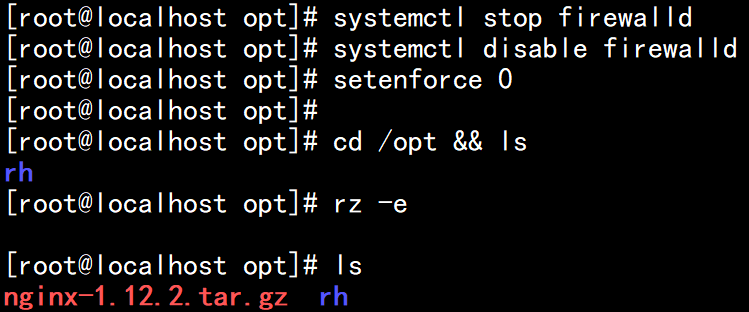

**2）安装依赖环境**
Nginx的配置及运行需要pcre、zlib等软件包的支持，因此需要安装这些软件包的开发包，以便提供相应的库和头文件。

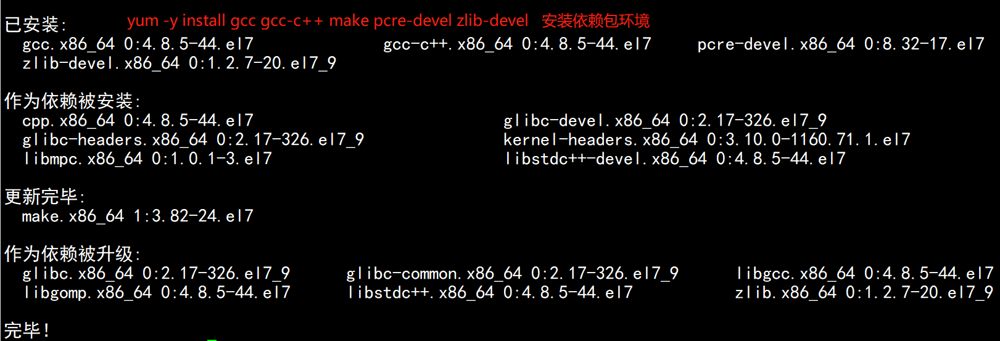

**3）创建运行用户、组**
Nginx服务程序默认以nobody身份运行，建议为其创建专门的用户账号，以便更准确地控制其访问权限。

**4）解包并编译、安装**
解包、./configure配置

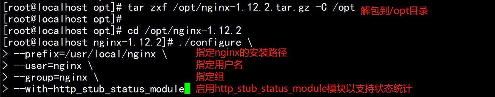

make编译、安装

**5）让系统识别nginx的操作命令、检查配置文件，启动Nginx服务**

**6）查看Nginx进程信息、关闭Nginx**

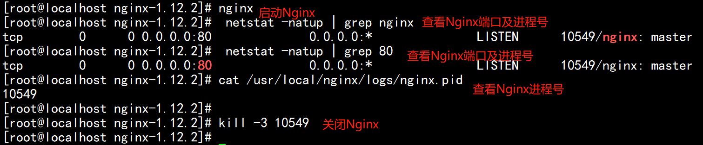

**7）查看Nginx版本（nginx -v）**

**8）添加Nginx系统服务**

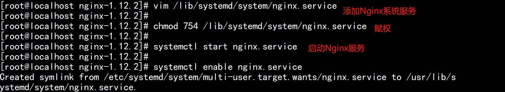

其中vim进入/lib/systemd/system/nginx.service文件添加的相关内容为：

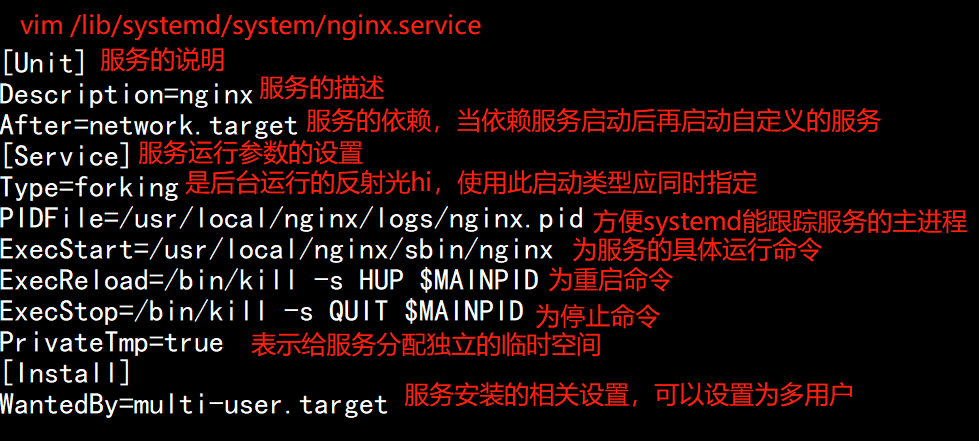

**9）验证安装成功**
进入浏览器界面输入本机IP地址访问，出现如下界面表示Nginx服务安装成功

### 二、配置文件nginx.conf

在Nginx服务器的主配置文件/usr/local/nginx/conf/nginx.conf中，包括全局配置、I/O事件配置和HTTP配置这三大块内容，配置语句的格式为“关键字 值；”（末尾以分号表示结束），以“ # ”开始的部分表示注释。

**1、全局配置**
由各种配置语句组成，不使用特定的界定标记。全局配置部分包括Nginx服务的运行用户、工作进程数、错误日志、PID存放位置等基本信息。

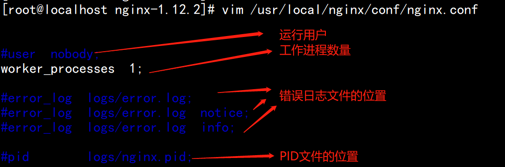

上述配置中，worker——processes表示工作进程的数量。若服务器有多块CPU或者使用多核处理器，可以参考CPU核心总数来指定工作进程数，如设为8；如果网站访问量需求并不大，一般设为1就够用了。其他三项均已有注释，表示采用默认设置。例如，Nginx的运行用户实际是编译时指定的Nginx，若未编译时未指定则默认为nobody。

**2、I/O时间配置**
使用“events { }”界定标记，用来指定Nginx进程的I/O响应模型、每个进程的连接数等设置。对于2.6及以上版本的内核，建议使用epoll模型以提高性能；每个进程的连接数应根据实际需要来设定，一般在10000以下（默认为1024）。

若工作进程数为8，每个进程处理4096个连接，则允许Nginx正常提供服务的连接数已超过三万个（4098*8=32768)，当然具体还要看服务器硬件、网络宽带等物理条件的性能表现。

**3、HTTP配置**
使用“http { }"界定标记，包括访问日志、HTTP端口、网页目录、默认字符集、保持连接，以及后面要讲到的虚拟Web主机、PHP解析等一系列设置，其中大部分配置语句都包含在子界定标记”server{ }“内。

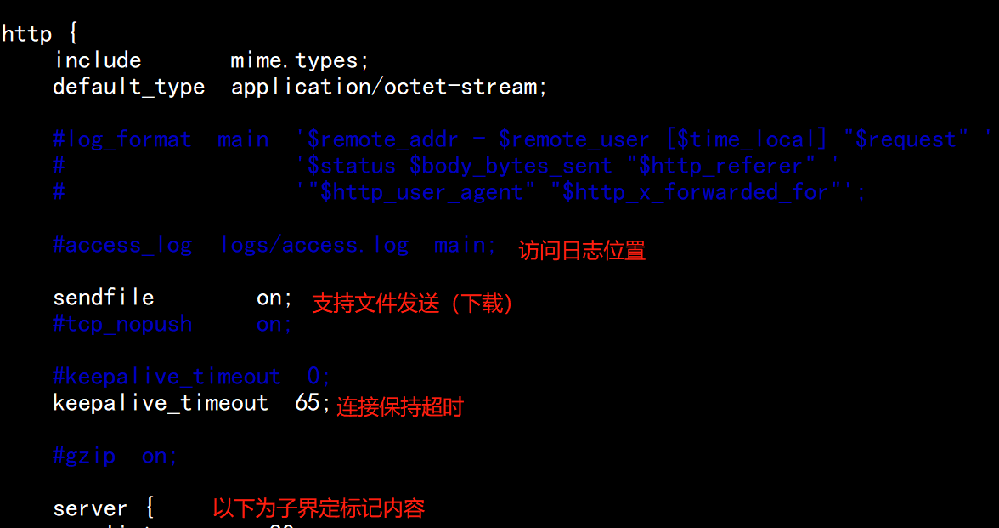

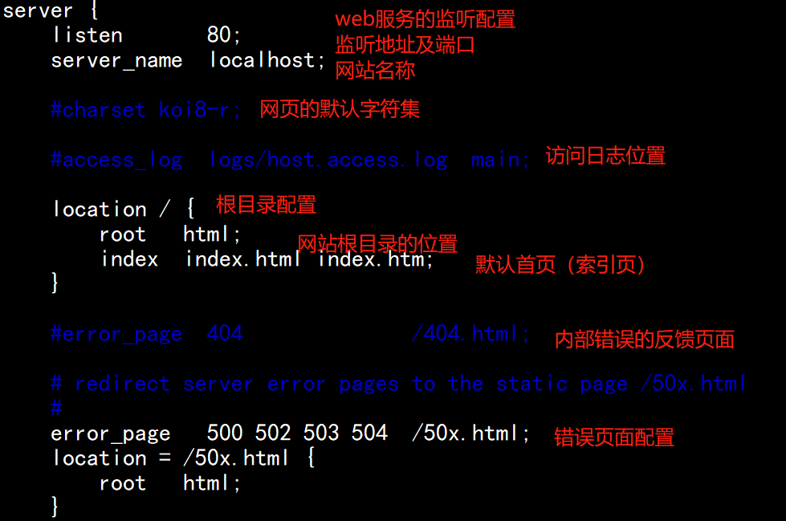

上述配置中，listen语句允许同时限定IP地址，采用"IP地址：端口"的形式；root语句用来设置特定访问位置（如”location /“表示根目录）的网页文档路径，默认为Nginx安装目录下的html/子目录，根据需要可以改为/var/www/html等其他路径。

### 三、访问状态统计

**1、查看是否包含状态统计模块**
Nginx内置了HTTP_STUB_STATUS状态统计模块，用来反馈当前的Web访问情况，配置编译参数时可添加–with-http_stub_status_module来启用该模块，可以使用命令/usr/local/nginx/sbin/nginx -V来查看已安装的Nginx是否包含HTTP_STUB_STATUS模块。

**2、修改配置文件，添加stub_status配置代码**
要使用Nginx的状态统计功能，除了启用内建模块外，还需要修改nginx.conf配置文件，指定访问位置并添加stub_status配置代码。

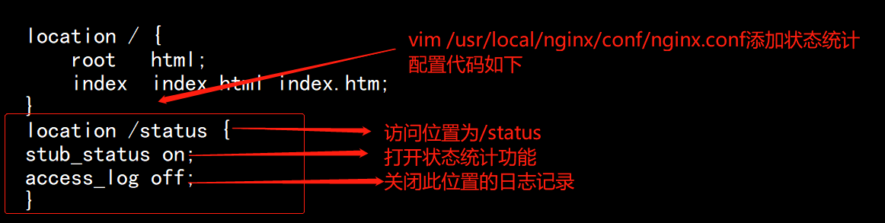

**3、验证状态统计**
配置完成后，执行命令”systemctl restart nginx"重启nginx，在浏览器中访问虚拟机(Nginx服务器)的/status网站位置，可以看到如下图信息：

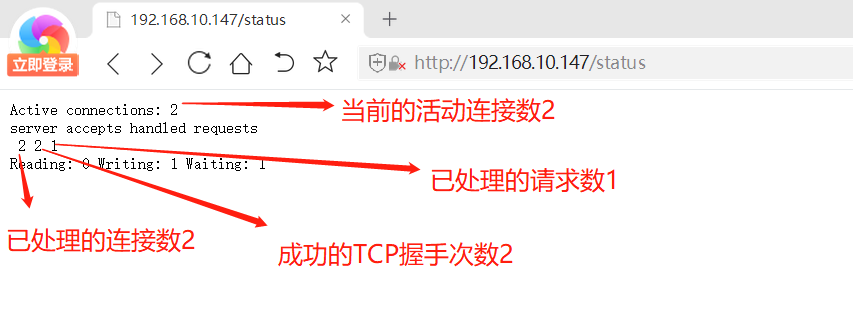

### 四、Nginx访问控制

**1、基于授权的访问控制**
**1）基于授权的访问控制简介**
Nginx与Apache一样可以实现基于用户授权的访问控制，当客户端需要访问相应的网站或者目录时，要求用户输入用户名和密码才能正常访问，配置步骤与Apache基本一致。

①生成用户密码认证文件

②修改主配置文件相对应目录，添加认证配置项

③重启服务，访问测试

**2）基于授权的访问控制步骤**
①使用htpasswd生成用户认证文件

出现如上错误“未找到命令”可以使用yum安装httpd-tools软件包，再执行操作“httpd -c /usr/local/nginx/passwd.db test"

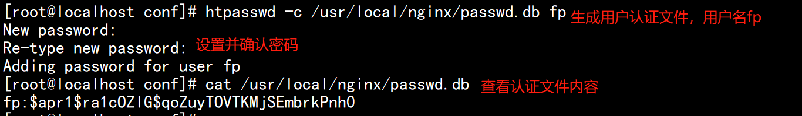

在/usr/local/nginx/目录下生成了passwd.db认证文件，用户名是fp，并在passwd.db文件中生成用户和密码的密文。

②修改密码文件权限为400，将所有者改为nginx，设置nginx的运行用户能够读取

③修改主配置文件nginx.conf，添加相应认证配置项

件，用户名是fp，并在passwd.db文件中生成用户和密码的密文。

②修改密码文件权限为400，将所有者改为nginx，设置nginx的运行用户能够读取

[外链图片转存中…(img-IkRGVrhM-1659055440493)]

③修改主配置文件nginx.conf，添加相应认证配置项

————————————————

版权声明：本文为CSDN博主「FP202530」的原创文章，遵循CC 4.0 BY-SA版权协议，转载请附上原文出处链接及本声明。

原文链接：https://blog.csdn.net/FP202530/article/details/126047985